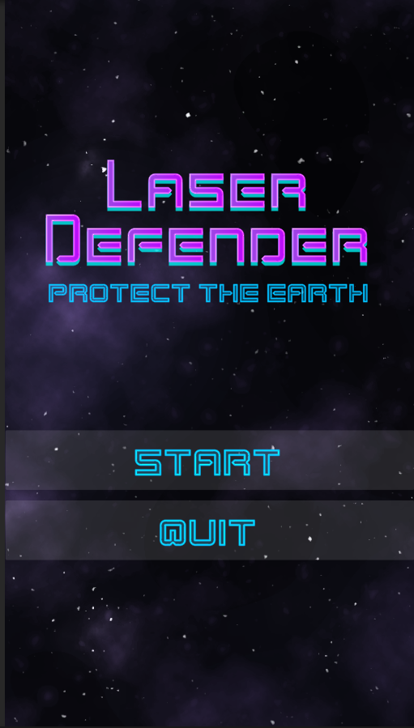
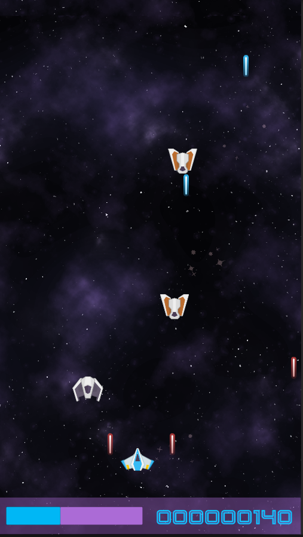
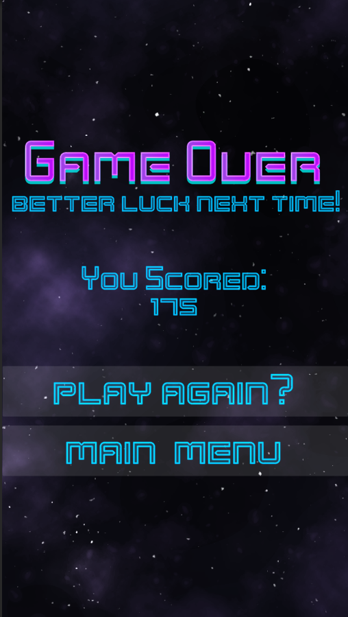

# Laser Defender - A 2D Space Shooter Game
Laser Defender is a 2D space shooter game developed using Unity and C#. In this game, players control a spaceship and engage in intense battles against waves of enemies. The objective is to survive enemy attacks, avoid their bullets, and defeat as many enemies as possible.

GAMEPLAY:
Controls: Players can control the spaceship using either the WASD keys or the arrow keys. The spaceship shoots lasers when the spacebar or left mouse button is pressed.

Enemies: Waves of enemies appear on the screen and shoot at the player's spaceship. Players must dodge enemy bullets while firing their lasers to destroy the enemies.

Health: The player's spaceship has a certain amount of health. Getting hit by enemy bullets reduces health. The game ends if the player's health reaches zero.

SCENE:
The game consists of three main scenes:

Main Menu: The main menu scene is the starting point of the game. Players can start the game, access settings, or exit the game from here.

Game: The game scene is where the gameplay takes place. Players control their spaceship, engage in battles, and aim to survive as long as possible against waves of enemies.

Game Over: When the player's spaceship health reaches zero, the game transitions to the game-over scene. Here, players can see their score and choose to restart the game or return to the main menu.

SCREENSHOTS:

