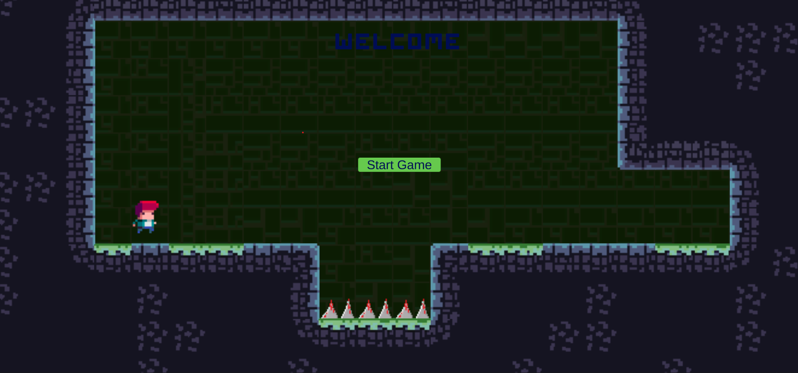
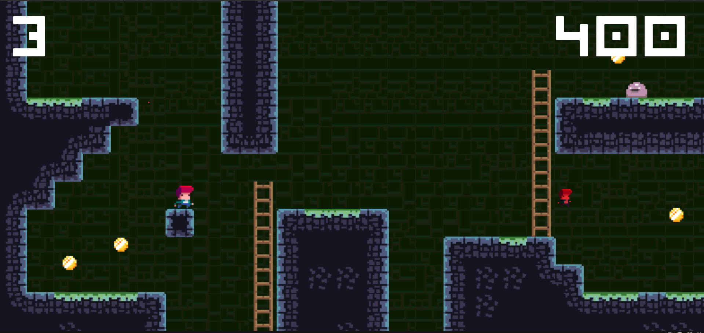
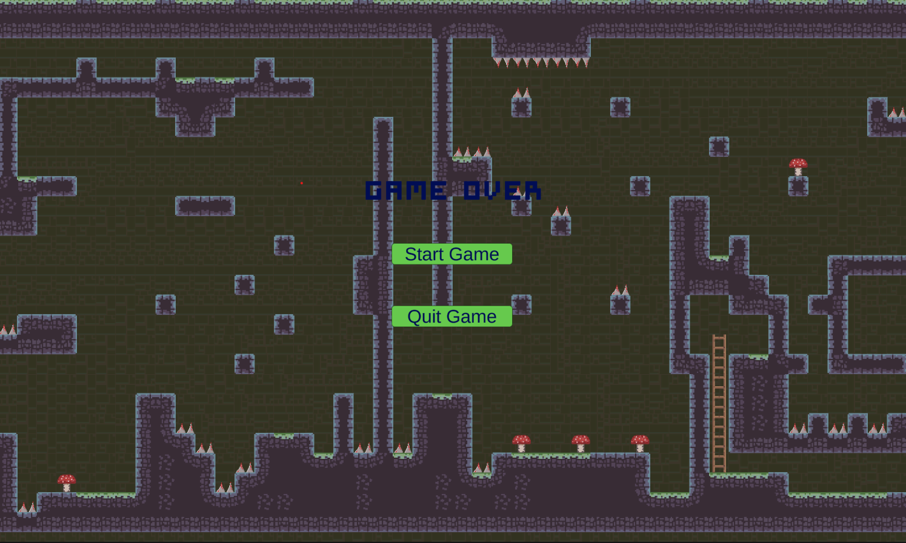

#RealmRunner - An 2D Adventure Platformer Game
RealmRunner is an exciting adventure platformer game developed using Unity and C#. In this game, players embark on a journey to collect coins, defeat enemies, and navigate through levels to reach the exit. The challenge lies in managing lives and making it to the next level without running out of lives.

Gameplay
Controls: Players can control the main character using either the WASD keys or the arrow keys. The character can jump using the spacebar and shoot by clicking the left mouse button.

Objective: The main objective is to explore levels, collect as many coins as possible, defeat enemies, and ultimately find the exit to progress to the next level.

Lives: The player starts with a certain number of lives. Losing all lives results in a game over. Collecting power-ups or extra lives can help the player along the way.

Scenes
The game consists of three main scenes:

Main Menu: The main menu scene serves as the starting point of the game. Players can start the game, access options, or exit the game from here.

Gameplay: The gameplay scene is where the core action takes place. Players navigate through multiple levels, collect coins, defeat enemies, and aim to find the exit. Each level presents new challenges.

Game Over: When the player runs out of lives, the game transitions to the game over scene. Here, players can see their final score, retry the game, or return to the main menu.

Screenshots:

