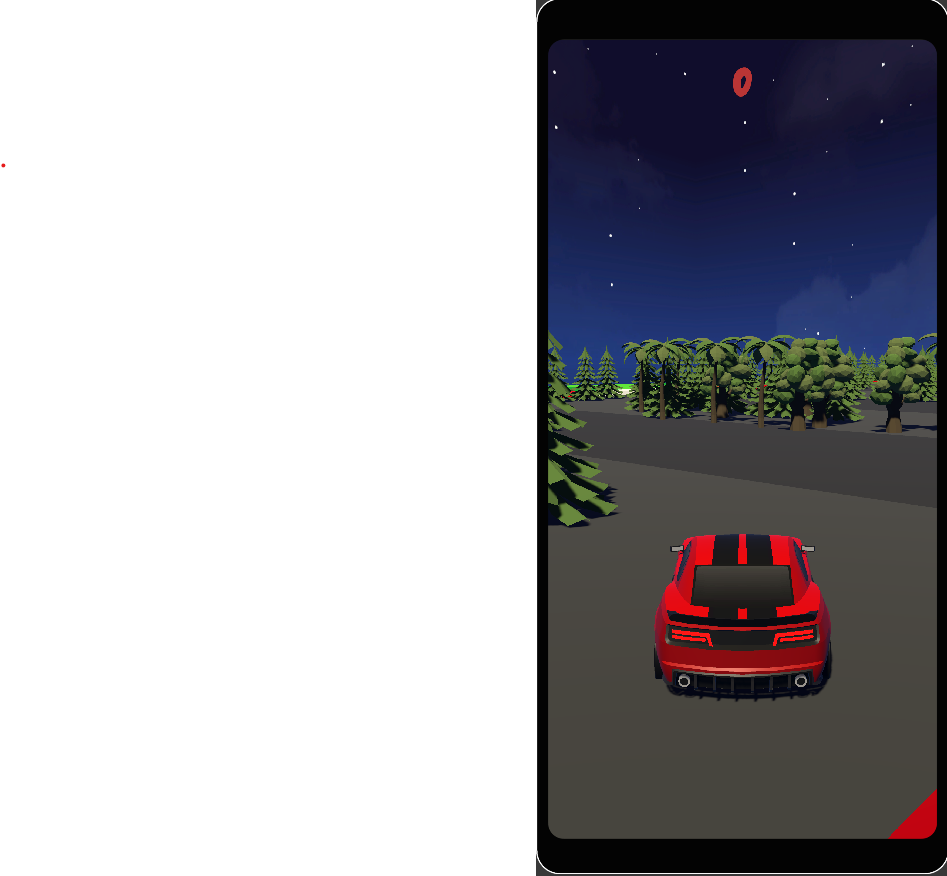
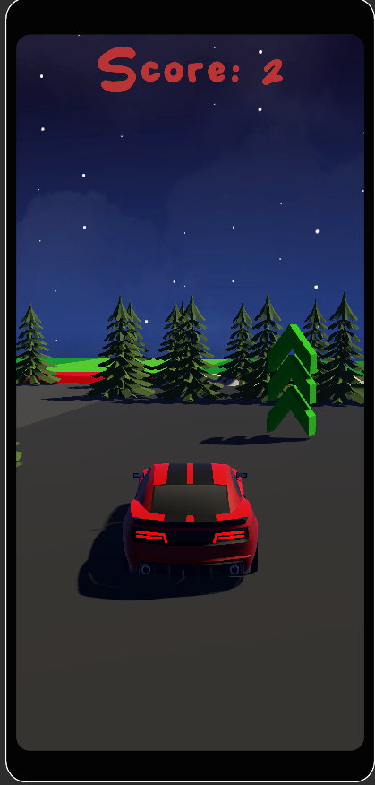
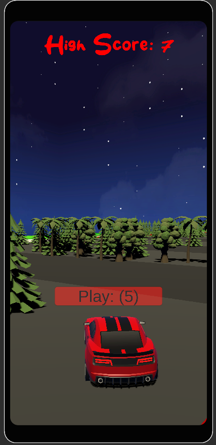

#Woodland Wheels: Roundabout Driving Game

Welcome to Woodland Wheels, a thrilling mobile touch game where you'll navigate a car through a roundabout amidst a lush forest of trees. Your goal is to avoid the obstacles while collecting power-ups to enhance your driving experience and boost your score. Get ready for an exciting journey!

## Gameplay

- **Objective:** Drive your car through the roundabout and avoid crashing into the trees.
- **Controls:** Use touch controls to steer the car. press left and right to move around the roundabout.
- **Score:** Your score increases with every passing second, so aim for a high score by staying on the track and avoiding obstacles.
- **Power-Ups:** Collect power-ups that appear on the track. These power-ups can either increase your speed or boost your score.

## Features

- Intuitive touch controls for an immersive gaming experience.
- Dynamic roundabout track with challenging obstacles in the form of trees.
- Exciting power-ups to collect: Speed Boost and Score Multiplier.
- Increasing difficulty as you progress, making each round more thrilling.
- Compete with friends and family to see who can achieve the highest score.

Screenshots:

